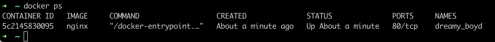
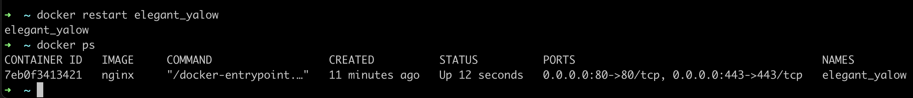
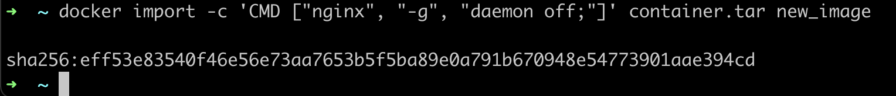
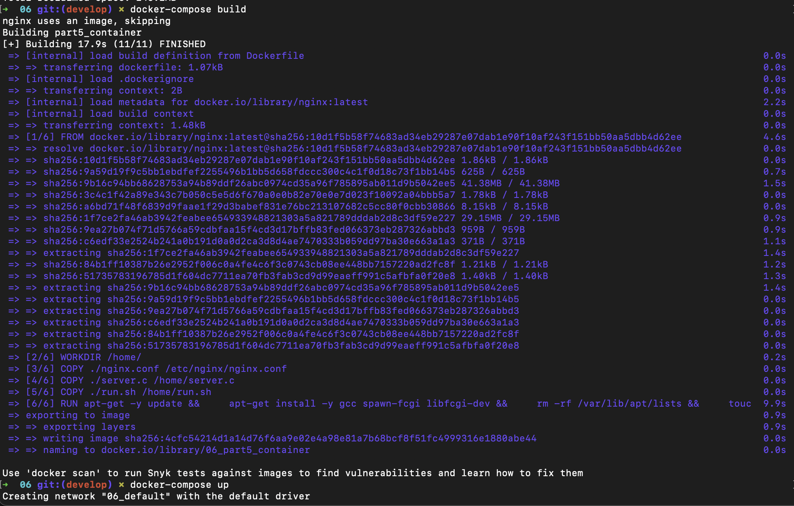

## Part 1. Ready-made docker  

- ``устанавливаем docker (для мак ос нужно поместить его в папку goinfre см.ниже)``  

если не открываеться установленый докер туториал как пофиксить -> https://21-school-by-students.notion.site/Docker-useful-info-13e8d7058e70418b8b0c6f23639640b9``

- ``далее через терминал скачиваем nginx ``  
  
- ``Проверить наличие докер образа через docker images ``  
  
- `` Запустить докер образ через docker run -d [image_id|repository] ``  
  
- ``Проверить, что образ запустился через docker ps``  
  
- ``Посмотреть информацию о контейнере через docker inspect [container_id|container_name] ``  
  
- `` По выводу команды определить и поместить в отчёт размер контейнера, список замапленных портов и ip контейнера ``  
  
  
  
- ``Остановить докер образ через docker stop [container_id|container_name] ``  
  
- ``Проверить, что образ запустился через docker ps``  
  
- ``Запустить докер с портами 80 и 443 в контейнере, замапленными на такие же порты на локальной машине, через команду run``  
  
- ``Проверить, что в браузере по адресу localhost:80 доступна стартовая страница nginx``  
  
  
- ``Перезапустить докер контейнер через docker restart [container_id|container_name``  
  

## Part 2. Operations with container  
- ``Прочитать конфигурационный файл nginx.conf внутри докер контейнера через команду exec``  
  
- ``Создать на локальной машине файл nginx.conf``  
  
- `` Создать на локальной машине файл nginx.conf Настроить в нем по пути /status отдачу страницы статуса сервера nginx ``  
  
- ``Скопировать созданный файл nginx.conf внутрь докер образа через команду docker cp ``  
  
- ``Перезапустить nginx внутри докер образа через команду exec``  
  
- ``Проверить, что по адресу localhost:80/status отдается страничка со статусом сервера nginx``  
  
  
- ``Экспортировать контейнер в файл container.tar через команду export``  
  
- ``Остановить контейнер``  
  
- ``Удалить образ через docker rmi [image_id|repository], не удаляя перед этим контейнеры``  
  
- ``Удалить остановленный контейнер``  
  
- ``Импортировать контейнер обратно через команду import``  
  
- ``Запустить импортированный контейнер``  
  
- ``Проверить, что по адресу localhost:80/status отдается страничка со статусом сервера nginx``  
  
  

## Part 3. Mini web server  
- ``Написать мини сервер на C и FastCgi, который будет возвращать простейшую страничку с надписью Hello World!``  
  
- ``Написать свой nginx.conf, который будет проксировать все запросы с 81 порта на 127.0.0.1:8080``  
  
- ``Запустить написанный мини сервер через spawn-fcgi на порту 8080``  
- ``    последовательность действий``  
- ``docker pull nginx ``
- ``docker images``
- ``docker run -d -p 81:81 [DOCKER_ID]``
  
  
- `` docker cp nginx.conf [CONTAINER ID]:/etc/nginx/ ``  
- `` docker cp server.c [CONTAINER ID]:/home/ ``  
- `` docker exec -it [CONTAINER ID] bash     // чтобы подключиься к контейнеру``  

#### настройка окружения внутри контейнера  

- ``apt-get update``  
- ``apt-get install gcc``  
- ``apt-get install spawn-fcgi``  
- ``apt-get install libfcgi-dev``  
- ``gcc *.c -lfcgi``  
- ``spawn-fcgi -p 8080 /screenshots/a.out``  
- ``nginx -s reload``  
  
  
  
  
- ``Проверить, что в браузере по localhost:81 отдается написанная вами страничка ``  
  

## Part 4. Your own docker  

- ``Написать свой докер образ, который:``  
- `` 1) собирает исходники мини сервера на FastCgi из Части 3``  
- `` 2) запускает его на 8080 порту``  
- `` 3) копирует внутрь образа написанный ./nginx/nginx.conf``  
- `` 4) запускает nginx.``  
  
  

- ``собрали Docker``  
  

- ``Проверить через docker images, что все собралось корректно``  
  
- ``Запустить собранный докер образ с маппингом 81 порта на 80 на локальной машине и маппингом папки ./nginx внутрь контейнера по адресу, где лежат конфигурационные файлы nginx'а (см. Часть 2)``  
  
- ``Проверить, что по localhost:80 доступна страничка написанного мини сервера``  
  
- ``Дописать в ./nginx/nginx.conf проксирование странички /status, по которой надо отдавать статус сервера nginx``  
  

## Part 5. Dockle  

- `` Перед началом устанавливаем утилиту dockle: $ brew install goodwithtech/r/dockle ``  
  

- `` проверяем наш dockerfile через утилиту dockle ``  
  
- ``текущий билд докера``  
  
- ``исправленный билд: удоляем текущую сборку командой  $ docker system prune --all, собираем заново``  
  
- ``Исправить образ так, чтобы при проверке через dockle не было ошибок и предупреждений``  
  
  

## Part 6. Basic Docker Compose  

- `` Написать файл docker-compose.yml, с помощью которого: `` 
- `` 1) Поднять докер контейнер из Части 5 (он должен работать в локальной сети, т.е. не нужно использовать инструкцию EXPOSE и мапить порты на локальную машину) ``  
- `` 2) Поднять докер контейнер с nginx, который будет проксировать все запросы с 8080 порта на 81 порт первого контейнера  ``  
  

- ``устанавливаем $brew install docker-compose``  
  
- ``docker-compose build``  
  
- ``docker-compose up``  
  
  
 <bt>
  
  

