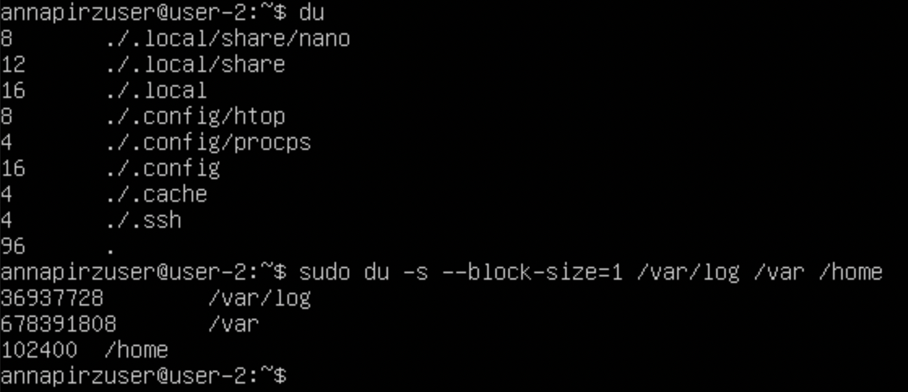
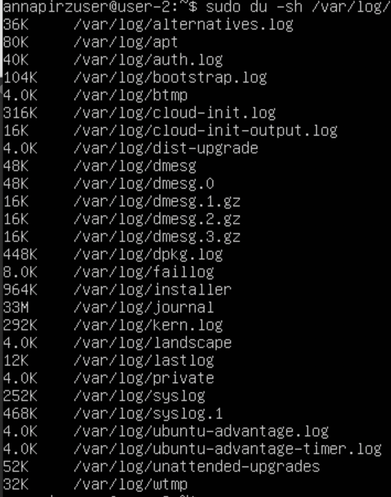
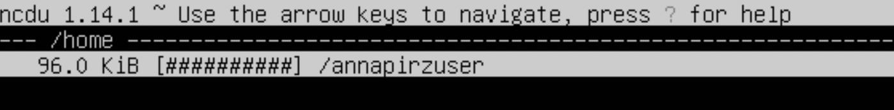
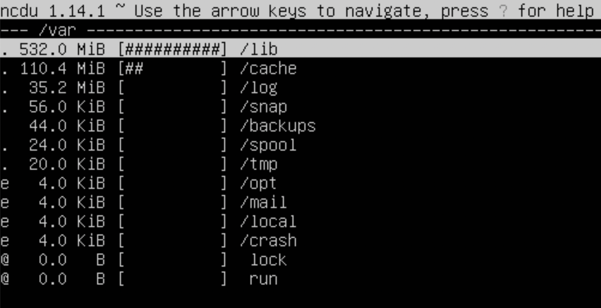
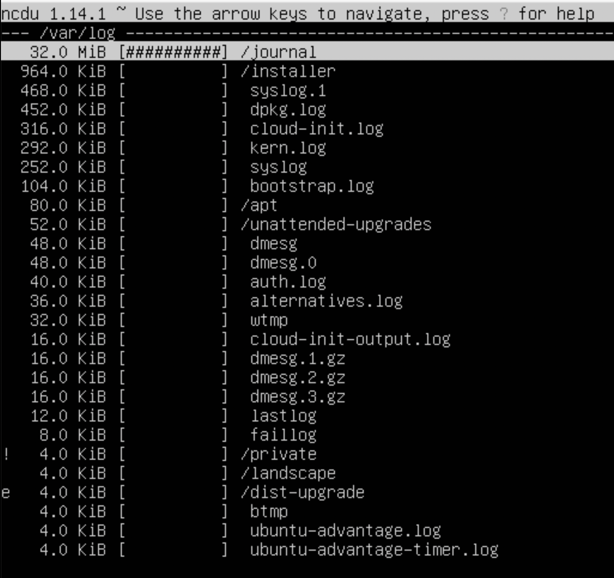
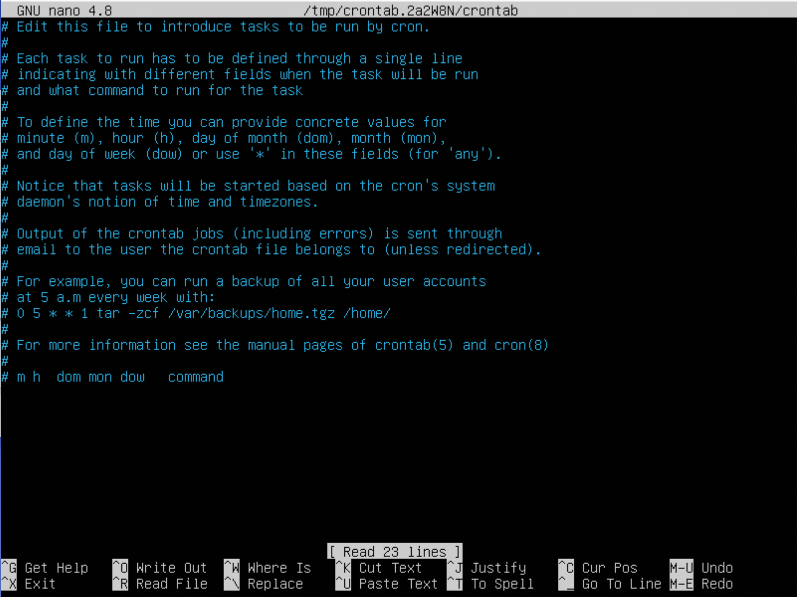
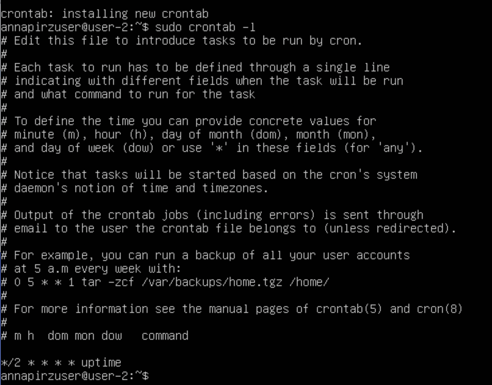
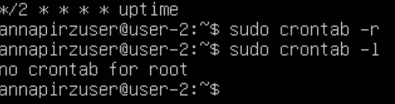

# REPORT DevOps 1 Linux  

## Part 1. Installation of the OS  

- ``Смотрим версию Ubuntu после установки $ cat /etc/issue``  
  

---

## Part 2. Creating a user  

- `` команда создания нового пользователя $ sudo useradd 'user-name' ``  
- `` Команда добавления нового user-а в группу adm $ sudo usermod -aG adm 'username' ``  
  

- ``вывод нового user на экран $ cat /etc/passwd ``  
  

---

## Part 3. Setting up the OS network  

- `` команда изминения хоста $ sudo hostnamectl set-hostname 'new-name' ``  
- `` прсмотреть имя хоста $ hostnamectl ``  
  

- `` чтобы посмотреть список доступных временных зон $ timedatectl list-timezone ``  
- `` Чтобы поменять времменую зону введите команду $ sudo timedatectl set-timezone 'Europe/Moscow ``  
- `` посмотреть текущую временную зону $ timedatectl ``  
  

- `` устонавливаю утилиту net-tools $ sudo apt install net-tools ``  
- `` вывод информации о сетевых интерфейсах $ sudo ifconfig -a ``  
  

- `` Интерфейс "lo" в сети linux является особбеным и обозначает "loopback" или петлевой интерфейс этот интерфейс предстаавляет собой виртуальны сетевой интерфейс присуцтвует на всех linux ``   
- `` Адресс ip 127.0.0.1 по началу lo настроен на это сетевой адресс, ипользуется для локального тестирования и отладки систем ``  
  

- `` DHCP - (Dynamic Host Configuration Protocol) - это протокол сетевой конфигурации, который используется для автоматической настройки IP-адресов и других параметров сети для устройств , подключенных к сети, таких как компьютеры, смартфоны, принтеры и другие сетевые устройства. DHCP позволяет упростить процесс настройки сети, особенно в больших сетях.(Dynamic Host Configuration Protocol) - это протокол сетевой конфигурации, который используется для автоматической настройки IP-адресов и других параметров сети для устройств, подключенных к сети, таких как компьютеры, смартфоны, принтеры и другие сетевые устройства. DHCP позволяет упростить процесс настройки сети, особенно в больших сетях. ``  
- `` получение ip от dhcp сервера $ hostname -I ``  
  

- `` узнвем внешний ip adress $ curl ifconfig.me/ip ``  
  
- `` узнаем внутренний ip (gw) $ ip route ``  
  

- `` меняем настройки сети vim-ом $ sudo vim /etc/netplan/*.yaml , сохроняем и перезагружаем $ reboot `` 
  
- `` проверка пинга 1.1.1.1  и ya.ru $ ping 1.1.1.1 \\ $ ping ya.ru``  
  
  
- `` проверка на потерю покетов $ ping -v [host] ``  
  

---

## Part 4. OS Update  
- `` Обновление сиситемных пакетов $ sudo apt update `` <b>
  

---

## Part 5. Using the sudo command  

- `` sudo - Superuser Do это команда и механизм в Unix подобных операционных систем таких как linux и macOs ``  
- `` С помощью sudo обычныее пользователи могут выполнить команды, требующие административных прав, после футенфикации ``  
- `` Аудит и учет использование sudo каждый запуск sudo можно отслеживать и анализировать кто и когда выполнял когда-либо административные действия ``  
-  `` тобы предоставить пользователю права выполнения команд с использованием sudo $  sudo usermod -aG sudo "user" чтобы проверить вступило ли изменение в силу $ groups "user" ``  
- `` переключитель на другого пользователя и спенили hostname ``  
  

---

## Part 6. Installing and configuring the time service  
- `` проверка статуса службы $ systemctl status systemd-timesyncd ``  
- `` если служба выключена вводим $ sudo systemctl enable systemd-timesyncd `` 
- `` проверка параметров службы $ timedatectl show ``  

--

## Part 7. Installing and using text editors  
- `` установка vim, nano, joe $ sudo apt instal "редактор" ``  
  
  
 

- `` чтобы создать файл в vim вводим $ vim text_file.txt чтобы редактировать текст нажимаем 'i' чтобы сохранить и выйти наимаем 'esc' 'shift' + ':' и вводим 'wq' чтобы выйти без сохронения 'q!'``  
  
- `` чтобы создать файл в nano вводим $ nano text_file.txt редактируем, сохроняем 'ctr' + 'o' и выходим 'ctr' + 'x' чтобы выйти без сохранений нажмите 'ctr' + 'x' + 'N'``  
  
- `` чтобы создать файл в joe вводим $ joe text_file.txt чтобы сохранить 'ctr' + 'k' выйти 'ctr' + 'c' выйти без сохранения ctr + k + Q + n``  
 

- `` чтобы искать слово в vim нажать '/' ``  
  
- `` чтобы искать слово в nano 'ctr' + 'w' ``  
  
- `` чтобы искать в joe 'ctr' + K + F ``  
  

---

## Part 8. Installing and basic setup of the SSHD service  

 - `` скачиваем shh-server $sudo apt install openssh-server и ставим автозапуск $ sudo systemctl enable ssh ``  
   

 - `` меняем порт $ sudo nano /etc/ssh/sshd_config  и перезагружаем службу ssh $sudo systemctl restart ssh ``  
   
   

- `` команда для нахождения процесса ssh $ ps -e | grep sshd `` 
  

ps -e или ps -A (Чтобы просмотреть все запущенные процессы); 
ps -d (Чтобы показать все процессы, кроме лидеров сессии); 
ps -d -N (можно инвертировать вывод с помощью переключателя -N. Например, если хочу вывести только лидеров сеансов)
ps T (увидеть только процессы, связанные с этим терминалом); 
ps r (просмотреть все работающие (running) процессы); 
ps -p 'pid' (если вы знаете идентификатор процесса PID, вы можете просто использовать следующую команду, для вывода процесса с этим 'pid'); 
ps -p 'pid1' 'pid2'
ps U 'userlist' (найти все процессы, выполняемые конкретным пользователем); 
ps -ef (получить полный список); 

- `` рестартаем систему $ netstat - tan ``
  

Флаги для netstat : -t (--tcp) отображает только tcp соединения; -a (--all) отображает все активные TCP соединения; -n (--numeric) отображает активные TCP соединения с адресами и номерами портов в числовом формате; Proto: имя протокола (протокол TCP или протокол UDP); recv-Q: очередь на получение сети; end-Q: очередь на отправку сети; Local Address адрес локального компьютера и номер используемого порта; Foreign Address адрес и номер удаленного устройства, к которому подключен сокет; State состояние сокета; 0.0.0.0 означает IP-адрес локального устройства.

---

## Part 9. Installing and using the top, htop utilities  

- `` установка утилиты htop  $ sudo apt install htop, установка утилиты top $ sudo apt install procps ``  
  

-  'u' + 'uptime' кол-во авторизованых пользоватеелй 1;  
- время работы 11 min;  
- общая загруженность сиситемы - 0.00 0.00 0.01  
- общее количество процессов 94  
- загрузка цпу 0.3  
- загрузка памяти 138.1/956  
- pid процесс занимающий больше всего памяти 651, использовал комбинацию 'shift' + 'M' или top -o %MEM  
- pid процесс занимающий больше всего времени - 383 комбинация shift + P или top -o %CPU  

- `` команды htop '/' - поиск процесса,  '\' - фильровать процесс ``  
  
  
  
  
  
  
  

---

## Part 10. Using the fdisk utility  

- `` $ sudo fdisk -l || $ sudo swapon``  
  
- размер swap - 1.5g  
- название жесткого диска - VBOXHARDDISK  
- размер 10gib  
- количество секторов 20971520  

---

## Part 11. Using the df utility  
** df / **  
- размер раздела - 8408452  
- размер занятого пространства - 4203028  
- разммер свободного пространства - 3756708  
- процент использования - 53%  

  

** df -Th /**  

- размер раздела - 8.1Gb; 
- размер занятого пространства - 4.1Gb; 
- размер свободного пространства - 3.6Gb; 
- процент использования - 53%; 

  

- `` ext 4 журналированнная файловая система, используется премущественно в операционных системах с ядром Linux. Для записи журнала реализованно вычесление контрольных сумм, что позволяет быстрее находить и в некоторых испровлять ошибки системы ``   

---

## Part 12. Using the du utility  

  

- человеческом виде  

---

## Part 13. Installing and using the ncdu utility  

- `` sudo apt install ncdu ``  

- `` sudo /home ``  
  

- `` sudo /var ``  
  

- `` sudo /var/log ``  
  

---

## Part 14. Working with system logs  

- `` cat /var/log/dmesg``  
  

- `` cat /var/log/syslog ``  
  

- `` последняя авторизация sep 26 13:17:01 pam_unix(cron:session) ``

- `` перезапускаем sshd ``  
  

## Part 15. Using the CRON job scheduler  

- `` чтобы задать новую задачу в утилите cron команда $ crontab -e просмотреть список текущих задач  -e удалить -r`` 
  
  
  
  
