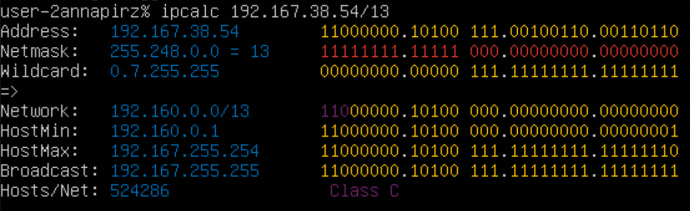
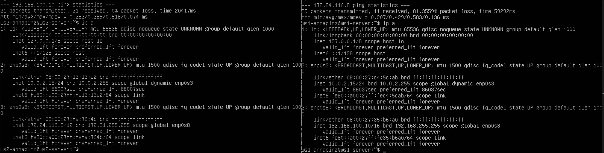
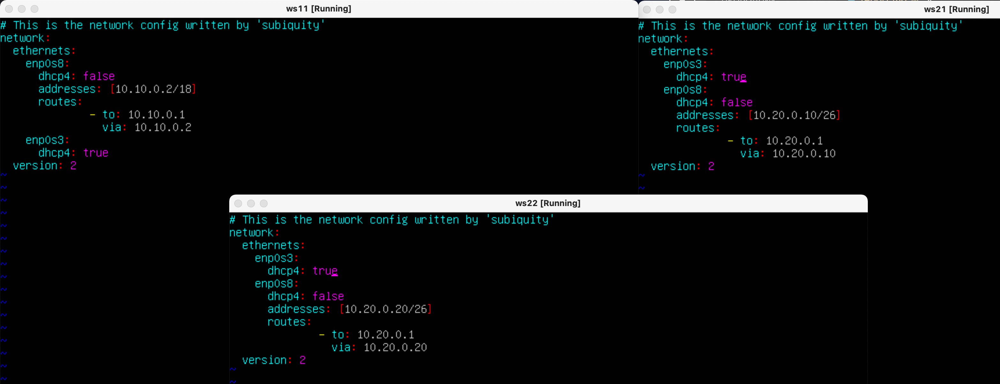
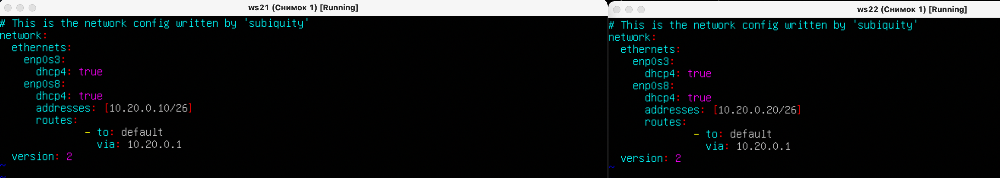
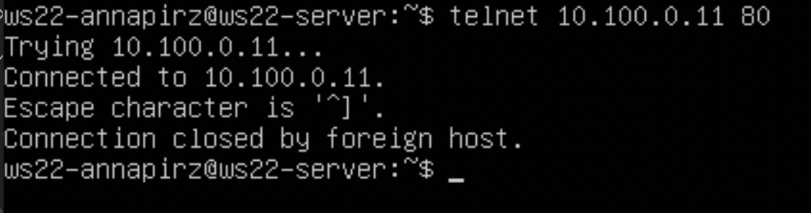

# Linux Network  

---

## Part 1. ipcalc tool  

### 1.1. Networks and Masks  

- `` устанавливаем утилиту ipcalc $ sudo apt install ipcalc ``  
- `` узнаем ip 192.167.38.54/13 $ ipcalc 192.167.38.54/13 ``  
  

- `` преобразования масок в префиксную /24, в обычную двоичную /15, перевод в 111111111.11111.11111.11110000 в обычную префиксную /28 ``  
  

- `` в сети 12.167.38.4 при масках: /8 hostmin - 12.0.0.1 hostmax - 12.255.255.254``  
- `` в сети 12.167.38.4 при масках: /4 hostmin - 0.0.0.1 hostmax - 15.255.255.254``  
- `` в сети 12.167.38.4 при масках: /255.255.254 hostmin - 12.167.38.1 hostmax - 12.167.39.254``  
  
- `` в сети 12.167.38.4 при масках: /11111111.11111111.00000000.00000000 hostmin - 12.167.0.1 hostmax - 12.167.255.254``  
  

### 1.2. localhost  

- ``194.34.23.100 - Нельзя ``  
- `` 127.0.0.2 - Можно, loopback ``  
- `` 127.1.0.1 - Можно, loopback ``  
- `` 128.0.0.1 - Нельзя ``  

  
  

### 1.3. Network ranges and segments  

- `` Чтобы определить, является ли IP-адрес публичным или частным, вы можете вручную сравнить его с известными диапазонами частных и публичных IP-адресов. Вот список стандартных приватных диапазонов IPv4: ``  

- `` 10.0.0.0 - 10.255.255.255 (CIDR /8) ``  
- `` 172.16.0.0 - 172.31.255.255 (CIDR /12) ``  
- `` 192.168.0.0 - 192.168.255.255 (CIDR /16) ``  
- `` Если IP-адрес находится внутри какого-либо из этих диапазонов, то он считается частным. В противном случае он считается публичным. ``  

- `` 10.0.0.45 - частный ``  
- `` 134.43.0.2 - публичный ``  
- `` 192.168.4.2 - частный ``  
- `` 172.20.250.4 - частный ``  
- `` 172.0.2.1 - публичный  ``  
- `` 192.172.0.1 - публичный ``  
- `` 172.68.0.2 - публичный ``  
- `` 172.16.255.255 - частный ``  
- `` 10.10.10.10 - частный``  
- `` 192.169.168.1 - публичный ``  

- `` У сети 10.10.0.0/18 могут быть следующие IP-адреса: 10.10.0.2 | 10.10.10.10 | 10.10.1.255 ``  
  

---

## Part 2. Static routing between two machines  

- `` подняли 2 вертуальные машины ws1 и ws2 $ ip a , в virtual box в настройках сети выбираем 'внутренняя сеть' адаптер 2 ``  
  

- ``присвоили адресс и маску ws1 - 192.168.100.10 путем установкии net-tools и запуска команды $ sudo vim /etc/netplan/*.yaml``  
  
- `` перезагружаем сеть командой $ sudo netplan apply ``  

- ``так же поступаем с 2й машиной ``  
  

- `` проверяем обе машины с помощью команды $ ip a ``  
  

### 2.1. Adding a static route manually  

- `` добовляем маршрут от ws2 к ws1 $ sudo ip r add 192.168.100.10 via 172.24.116.8 ``  
- `` добовляем маршрут от ws1 к ws2 $ sudo ip r add 172.24.116.8 via 192.168.100.10 ``  
- `` пропинговываем соединение между машинами ``  
  

### 2.2. Adding a static route with saving  

- ``добовляем статические маршруты от одной манины к другой ``  
  

- ``перезагружаем сетевые адаптеры $ sudo noteply apply ``  
- ``пропинговываем обе машины для проверки ``  
  

---

## Part 3. iperf3 utility  

- `` для того чтобы измерить скорость переачи данных от одной машины до другой будем использовать уилиту 'iperf3' ``  

- `` устанавливем iperf3 $ sudo apt install iperf3 ``  
  

- `` 8 MB/s - это 1 MB/s 100 MB/s - это 800000 KB/s 1 GB/s - это 1000 MB/s `` 
- `` запускаем сервер $ iperf3 -s ``  
- `` пингуем и проверяем соединение и скорость потока $ iperf3 -c 192.168.100.10 ``  
  

---

## Part 4. Network firewall  

- ``устанавливаем утилиту $ sudo apt-get install iptables ``  

- `` создаем файл $ sudo vim /etc/firewall.sh и прописыввем ему протокол, повторяем и на второй машине ``  
  

- `` проверяем соединение, пингуем ``  
  

## Part 5. Static network routing  
- `` поднимаем 3 машины и 2 раутера (5 машин), далее в virtual box настраиваем сети к 3м машинам подключаем 2й адаптер, к 2м роутерам пониаем 1,2,3, роутер внетрення сеть и называем int1 и int2 ``  
  

### 5.1. Configuration of machine addresses  
- `` присвоили адреса r1 и r1 путем установкии net-tools $ sudo apt install net-tools iи запуска команды $ sudo vim /etc/netplan/*.yaml ``  
  
- `` перезагружаем роутеры $ sudo netplan apply ``  
- `` прокидываем адреса как указано в табличке ``  

- `` 3 настроеных роутера ``  
  

- `` $ ip -4 a пропинговываем 3 машины``  
  

- `` ip -4 a r1 and r2 ``  
  

- `` пропинговываем  ws22 с ws21 и r1 с ws11``  
  

### 5.2. Enabling IP forwarding. 
- `` выполняю команду $ sudo sysctl -w net.i ``  
  
- ``открываем  $ sudo vim /etc/sysctl.conf и добавляем в него net.ipv4.ip_forward = 1 ``  
  

### 5.3. Default route configuration  
- `` в файлах .yaml в 3х машинах меняем router - to на default сохроняем $ sudo netplan apply ``  
  

- `` проверяем $ ip r ``  
  

- `` правильно настроили роутер r2 и запускаем команду $ tcpdump -th -i eth1 enp0s3 ``  
  

- `` с машины ws11 пингуем роутер r2 командой  $ ping 10.100.0.12 ``  
  

- `` итоговый результат на задание 5.3 ``   
  

### 5.4. Adding static routes  
- `` меняем конфигурацию сетей для настройки статических маршрутов, сохроняем изминения и перезапускаем $ sudo netplan apply ``  
  

- `` проверяем роутеры с помощью команды $ ip r ``  
- `` r1 ``  
  
- `` r2 ``  
  
- `` выполняем команды $ ip r list 10.10.0.0/18 и $ ip r list 0.0.0.0/0 ``  
  
- `` Маршрутизация и фильтрация трафика: В таблице маршрутизации, адрес 0.0.0.0 может использоваться для указания маршрута по умолчанию (default route). Когда сетевой пакет пытается найти подходящий маршрут в таблице маршрутизации и не находит точного совпадения с конкретным адресом, то он отправляется через маршрут по умолчанию, который может быть представлен как 0.0.0.0/0. ``  
### 5.5. Making a router list  
- `` устанавливаем утилиту $ sudo apt install traceroute ``  
- `` на роутере r1 вызываем команду $ sudo tcpdump -tnv -i enp0s8 ``  
  
- `` трасеруем маршрут с ws11 до ws 21 через команду $ traceroute -n 10.20.0.10 ``  
  

- `` Хост, с которого выполняется трассировка, отправляет пакеты на адрес назначения с разными показателями "времени жизни" TTL, начиная с 1 и постепенно его увеличивая. Каждый хост на пути к назначению отправляет пакет ICMP time exceeded in-transit, показывая, что пакет ещё не дошёл до адреса назначения. Адрес отправителя в данном пакете фиксируется в трассировке, как промежуточное звено на пути к адресу назначения. По умолчанию запросы от хоста-источника отправляются с помощью "проб"-пакетов (probes) по протоколу UDP, но с помощью ключей -I и -T можно заменить протокол на ICMP или TCP соответственно ``  

### 5.6. Using ICMP protocol in routing  
- `` для перехвата сетевого трафика c r1 вводим команду $ sudo tcpdumb -n -i enp0s8 icmp ``  
- `` c машины ws11 пингуем не существующий аддрес $ ping -c 1 10.30.0.111 ``  
- `` наблюдаем перехват роутером ``  
  

---

## Part 6. Dynamic IP configuration using DHCP  

- `` устанавливаем dhcp сервер $ sudo apt install isc-dhcp-server ``  
- `` открываем файл $ sudo vim /etc/dhcp/dhcpd.conf и меняем конфигурацию ``  
  
- `` $ sudo netplan apply $ reboot ``  
- `` открываем файл $ sudo vim /etc/resolv.conf и меняем nameserver на 8.8.8.8 ``  
  
- `` перезагружаем  DHCP службу командой $ sudo systemctl restart isc-dhcp-server ``  
- `` Посольку в сети появился DHCP-сервер, в файле конфигурации etc/netplan/00-installer-config.yaml изменим dhcp: true ``  
  
- `` в ws21 проверяем подключение с помощью команды ip a ``  
  
- `` пропинговываем ws22 с ws21 ``  
  
- `` для машины ws 11 добовляем macaddress и dscp4 true сохронем изменения и перезагружаем ``  
  
- `` так же устанавливаем для роутера r1 dhcp сервер $ sudo apt install isc-dhcp-server ``  
- `` проделываем все то же что и с роутером r2 ``  
- `` Для r1 настроить аналогично r2, но сделать выдачу адресов с жесткой привязкой к MAC-адресу (ws11). Провести аналогичные тесты ``  
  
  
  
- `` $ sudo dhclient -v ``  
  
- `` опция роутера ip-адрес [, ip-адрес...]; - адреса шлюзов для клиентской сети. Маршрутизаторы должны быть перечислены в порядке предпочтения. ``  
- ``опция IP-адрес серверов доменных имен [, IP-адрес...]; - Список DNS-серверов, доступных клиенту. Серверы должны быть перечислены в порядке предпочтения. ``  

---

## Part 7. NAT  

- `` устанавливаем apache server на машины ws22 and r1 командой $ sudo apt install apache2 ``  
- `` в виртуальной машине ws22 и роутере r2 заходим в файл $ sudo vim /etc/apache2/ports.conf ``  
  
  
- `` запускаем веб сервер apache2 командой $ service apache2 start на машинах ws22 and r1 ``  
  
- `` на машине r2 создаем фаервоол и прописываем в него правила, команда по созданию файла $ sudo vim /etc/firewall.sh ``  
- `` Добавить в фаервол, созданный по аналогии с фаерволом из Части 4, на r2 следующие правила: ``  
- ``1) удаление правил в таблице filter - iptables -F ``  
- ``2) удаление правил в таблице "NAT" - uptables -F -t nat ``  
- ``3) отбрасывать все маршрутизируемые пакеты -iptables --policy FORWARD DROP  ``  
  
- `` Запустим файл командами chmod +x /etc/firewall.sh и /etc/firewall.sh ``  
  
- `` проверяем соединение между ws22 и r1 командой ping ``  
  
  
-  `` FORWARD используется для обработки предназначенного для других серверов трафика, который не был создан на данном сервере. Эта цепочка в основном необходима для маршрутизации запросов на другие сервера. Эта цепочка в основном необходима для маршрутизации запросов на другие серверы. Поэтому при FORWARD DROP ws22 не пингуется c r1 ``  

- `` разрешаем маршрутизацию всех пакетов протокола ICMP на r2 ``  
  
- `` так же сохроняем изминения $ chmod +x /etc/firewall.sh и  sh /etc/firewall.sh ``  
- `` запускаем команду iptables -L для проверки выполнения протокола ``  
  
- `` пингуем между собой ws22 and r1 ``  
  
  
- `` добовляем еще 2 правила SNAT на порт машины r2 и добавить к веб серверу Apache запущенуму на ws 22 доступ из вне сети ``  
  
- `` t - указывает на используемую таблицу, p - указывает протокол (tcp, udp, upplite), s - указывает адрес источника пакета, d - указывает адрес назначения пакета, i - задает входящий сетевой интерфейс, 0 - указывает исходящий сетевой интерфейс:  ``  
- `` DNAT — подменяет адрес получателя в заголовке IP-пакета, основное применение — предоставление доступа к сервисам снаружи, находящимся внутри сети ``  
- `` SNAT — служит для преобразования сетевых адресов, применимо, когда за сервером находятся машины, которым необходимо предоставить доступ в Интернет, при этом от провайдера имеется статический IP-адрес ``   

- `` так же сохроняем изминения и запускаем скрипт $ sudo chmod +x /etc/firewall.sh || sudo sh /etc/firewall.sh ``  

- `` для проверки соединения по TCP для SNAT. 1) отключаем сетевой интерфейс NAT в virtualbox, подключимся к серверу apache2 с ws22 на r1 командой telnet 10.100.0.11 80 так же проверяем соединение по TCP для DNAT с r1 подключаемся к серверу Apache на ws22 командой $ telnet 10.100.0.12 8080`` 

---

## Part 8. Bonus. Introduction to SSH Tunnels  

- `` запускаем фаервоол с правами из части 7 на r2 ``  
  
- `` sudo chmod +x /etc/firewall.sh ``  
- `` sudo sh /etc/firewall.sh ``  

- `` меняем файл /etc/apache2/ports.conf изменяем строку listen 80 на listen localhost:80 ``  
  
- `` запускаем веб-сервер apache2 на ws22 на localhost ``  
  

- `` Воспользуeмся Local TCP forwarding с ws21 до ws22, чтобы получить доступ к веб-серверу на ws22 с ws21 ``  
  

- `` Воспользуемся Remote TCP forwarding c ws11 до ws22, чтобы получить доступ к веб-серверу на ws22 с ws11 ``  
  

- `` Для проверки, сработало ли подключение в обоих предыдущих пунктах, выполняем telnet 127.0.0.1 [локальный порт] ``  
  